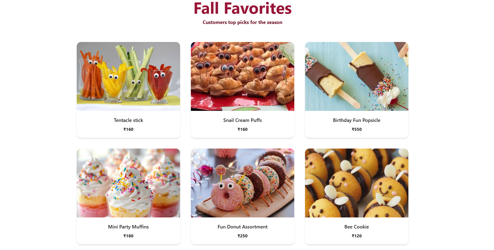

# 🍬 SweetlyYours — Online Sweets Ordering Platform

SweetlyYours is a full-stack web application for ordering sweets online with secure payments, personalized recommendations, and an intuitive, mobile-friendly experience.

---

## 🚀 Highlights

- 🛍️ **End-to-End Ordering & Management** — Secure payment gateway, authentication, user profiles, and real-time order tracking. Includes an admin dashboard for product management and live order monitoring.  
- 🤖 **Smart Personalization & Optimization** — Explored **time-series demand prediction** and **DSA-driven recommendation algorithms** to optimize product listings and improve personalized ordering experiences.

---

## 🖼️ Preview

> *UI Previews (Development Screens)*  




---

## 🧩 Tech Stack

**Frontend:** React.js, Tailwind CSS  
**Backend:** Node.js, Express.js  
**Database:** MongoDB  
**Auth & Payments:** JWT, Stripe/Razorpay  
**Optimization:** DSA-based filtering & time-series forecasting (research stage)

---

## 🛠️ Setup Instructions

1. **Clone the Repository**
   ```bash
   git clone https://github.com/yourusername/SweetlyYours.git
   cd SweetlyYours
